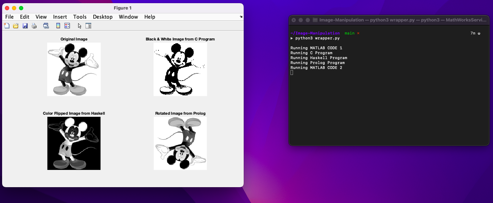

# Image-Manipulation

### About the Project

    A Python wrapper script that integrates MATLab, C, Haskell, and Prolog to manipulate an image

### File manifest:
    mickey.png
        - Contains the original photo 
    wrapper.py
        - Compile and execute each subprocess
        - Create new output file, "haskell_output.txt"
        - Create new output file, "prolog_output.txt"
    matlabcode1.m
        - Takes the original photo as input
        - Resizes photo
        - Converts img to 1D array output file, "input.txt"
          for other files
    cprog.c
        - Convert "input.txt"  to grayscale
        - Create new output file, "c_output.txt"
    hprog.hs
        - Flip the values of "input.txt"
        
    pprog.pl
        - 180 degree rotation of original img
    matlabcode2.m
        - Read img arrays from each output file
        - Display img from each output array

### Getting started:

    Use "python3 wrapper.py" to run program.
    Have python, MATLab, gcc, haskell, and prolog installed.

### Aknowledgments

    This program has a fairly long runtime.
    
